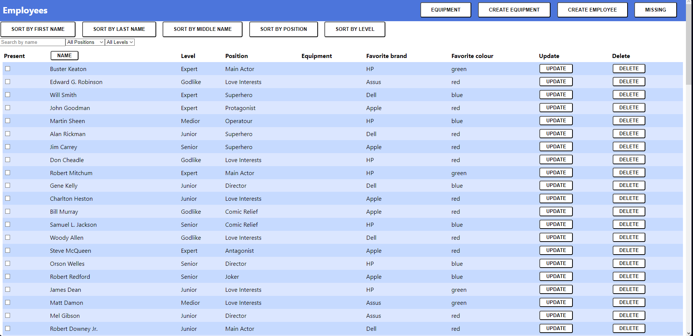

## Project Description

This project is basically a database of employees, containing their name, level, position, favorite brands and so on. We also have the posibility to sort the employees, and filter them by their position. We also have a database of equipments, and have the posibility to create equipments and add them to the employees. Moreover, we can add, delete and update the employees, and repopulate the databse automatically.



### Technologies Used

We utilized the following technologies:

- **Express.js**: Backend development, creating APIs.
- **MongoDB**: Storing user data and food information.
- **React**: Dynamic UI components.
- **Bootstrap**: Responsive styling.
- **CSS**: Custom styling.

### Challenges

Challenges faced during development:

- Connecting our server with MongoDB.

### Future Plans

Our plans for the future:

- Work on the design of the database.
- Implement the Worklog feature.

```## Employee Madness
## Project Description

This project is basically a database of employees, containing their name, level, position, favorite brands and so on. We also have the posibility to sort the employees, and filter them by their position. We also have a database of equipments, and have the posibility to create equipments and add them to the employees. Moreover, we can add, delete and update the employees, and repopulate the databse automatically.


### Technologies Used

We utilized the following technologies:

- **Express.js**: Backend development, creating APIs.
- **MongoDB**: Storing user data and food information.
- **React**: Dynamic UI components.
- **Bootstrap**: Responsive styling.
- **CSS**: Custom styling.

### Challenges

Challenges faced during development:

- Connecting our server with MongoDB.

### Future Plans

Our plans for the future:

- Work on the design of the database.
- Implement the Worklog feature.

# Employee Data

## Server side

### Install dependencies
```bash
cd ./server
npm install
```

### .env file
Copy the .env.sample as .env and fill up the environment variable for your personal mongodb connecttion url.

### Prepare the database

```bash
cd ./server
npm run populate
```

**populate command** will run the populate.js file as a script and it will generate a buch of starter data for your database. 

### Running the code

```bash
cd ./server
npm run dev
```

It will start the server with nodemon. So it will watch the changes and restart the server if some ot the files changed.

### Testing with test.http

If you like to try the endpoints of the rest api, you can check the test.http file for urls are should work on your environment as well. And if you install the [REST Client](https://marketplace.visualstudio.com/items?itemName=humao.rest-client) extenstion for vscode you can actually run those in your editor.


## Client side

### Install dependencies

```bash
cd ./client
npm install
```

### Proxy

Watch for the port of your rest api. By default it will bind on port 8080 and the frontend proxy settings also depend on this configuration. If you for some reasons change the port of the backend, don't forget to change the ./client/package.json proxy settings as well.

### Runnig the code

```bash
cd ./client
npm start
```

And the create-react-app react-scripts package will start your frontend on the 3000 port and you can visit the http://localhost:3000 on your preferred browser.
